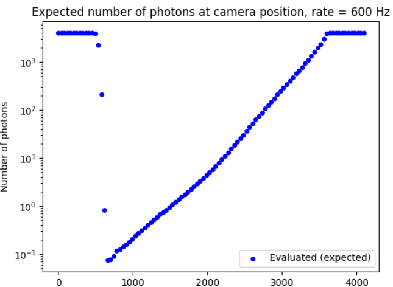

# Filter wheel study 

Filter wheel: https://www.thorlabs.com/thorproduct.cfm?partnumber=NDC-50C-4M

## Very first study
##  2-3 November 2022: data taking
**Data files**
- Filter wheel scan @ 30 MHz: "./03_11_2022_laser_intensity_7/d20221103_095800_calib/d20221103_095800_fw_scan.txt"
- Filter wheel scan @ 600 Hz: "./03_11_2022_laser_intensity_7/d20221103_100814_calib/d20221103_100814_fw_scan.txt"
- Filter wheel scan @ 1 MHz: "./03_11_2022_laser_intensity_7/d20221103_121654_calib/d20221103_121654_fw_scan.txt"

**Parameters**
- Laser intensity 7.0
- n_positions = 50
- acquisition time = 5 s
##  8-9-10 November 2022: data analysis
Script 'attenuation_study.py'
- Check if the filter wheel attenuation varies with the laser rate

- Linear Scale 

 

- Semilogaritmic scale 

 
- I observe that the attenuation @ 30 MHz is quite different, while the 1 MHz and 600 Hz are very similar
- I should evaluate the attenuation with 1 MHz or 600 Hz data

- I visualize how much different are the power measured and the number of photons at the PM laser at different rates
 

- 
 

- I expect (from the attenuation plot) to be detecting more photons @ 30 MHz at the same FW value; looking at the n_photons plot, this seems not to be the case: perhaps the rate is too high and the powermeter cannot keep up with the laser when the filter wheel lets all the light out, while at lower rates it can, even if the measured power is smaller. 

- I observe that the number of photons is the same as long as the FW position is < 2500-3000 (i.e. before the filter wheel lets out all light), than the photons @ 30 MHz are much less than the photons @ 1 MHz or 600 Hz: this could mean that when all light comes through and the frequency is very high, the powermeter cannot keep up with the rate.

- Have to dig a bit more into this

Script 'filter_wheel_study.py'

# 1st method

- Data @ 1 MHz: evaluate the attenuation of the filter wheel via the powermeter at laser source with 1 MHz data.

- Attenuation = pm_laser_array/pm_laser_max_value 

- 

- Data @ 1 MHz: plot of Power @ PM Cam VS FW position to see which FW positions are reliable (I chose the scan at 1 MHz since both the PM_Cam and the SiPM are able to detect) 

- Evaluating k value = (n_photons_cam@FWPos)/(att@FWPos) averaging between the last 10 FW positions
- Plot the results of n_photons@Camera VS FW position 

 

- I would like to have a plot of the number of photons at camera position at 600 Hz

- Evaluate the factor between measurements at 1 MHz and 600 Hz (on PM Laser) averaging on the last 10 FW positions and apply it to the n_photons @ camera @ 1 MHz:

- f= (n_photons_laser@600 Hz)/(n_photons_laser@1MHz)

- n_photons_camera @ 600 Hz = f* n_photons_camera @ 1MHz 

 
- Compare the two results: I see that the behaviour is the same but the values at 600 Hz are less in number (due to the fact that at 600 Hz even the PM laser has some null points, i.e. the power is smaller than the PMs sensitivity); that shouldn't be a big problem since the missing values are in the area where n_photons < 10 
- 
 
- Have a look to the SiPM data (@600 Hz) 

- NB: SiPM measurements should be repeated with more attention, data at low n_photons are not reliable (other than the fact that I'm not interested in measuring less than 1 photon, neither I can)... 

 
- From these plots I can observe that I could know the FW settings quite well between fw positions 2000 and 4095; that is also the region I am interested to for camera measurements (I would like to work with a number of photons at camera > 10). It would be nice to be able to exploit the whole dynamic range though (see later...)

- I could repeat more accurate measurements with the SiPM ...

-- Alternative method

# 2nd method 

- I evaluate the attenuation directly @ 600 Hz (even if I've seen that it doesn't differ much from the one at 1 MHz anyway) 

- I know that the number of photons I expect would be n_photons = attenuation * k, with k = (n_photons@FW_pos)/(attenuation@FW_pos): I can evaluate k either with the powermeter (camera) measurements or the SIPM measures.
-  At 600 Hz I can evaluate k_mean with the SiPM data at FW positions = [4095, 3342, 3677] and plot n_photons VS FW position @ 600Hz 

- 

- I can observe that for attenuation values greater than 0.01 (n_photons c.a. 10, cyan line) the methods are in agreement; all values above this line are the region I am interested in.

- At lower attenuation values it is not clear whether the methods can agree or disagree, but since we are speaking of Silicon Photomultipliers, we will never be in a situation where such low attenuation values (i.e. number of photons) are requested (purple line should ideally be the lower limit of my region of interest)

- As far as we consider only the physical region of interest, the two methods seem quite equivalent

- As we are interested in exploiting the whole dynamic range (i.e. all the fw positions), we should find a way to increase the number of photons: this could be achieved whether increasing the intensity of the laser (but we are already at 7.0 and above that the beam could become very unstable) or moving the camera closer to the laser (e.g. at 2 m instead of 3 m)

## 10/11/2022: repeating measurements @ 1 MHz, 600 Hz at a camera-laser distance of 2 m
- Laser intensity 7.0 
- Repeating the analysis 

- Comparison of the power @ PM CAM at 2 m and 3 m (distance camera-laser) 

 
- Comparison of the number of photons detected with the SiPM (1 p.e. = 0.19 mV, p.d.e. = 0.5, crosstalk = 0.25): I can see that moving the camera (SiPM) 1 m closer increases the number of detected photons only a bit (c.a. 1500 VS 2000 photons @ FW position 4095)  

 
- Comparison of results obtained with the new data @ 2 m: here I can see that again the two methods are pretty much equivalent 

- Comparison of results obtained with the SiPM data: still a big part of the filter wheel range is not "available" 

- Comparison between methods @ different distances  

- I can see that moving the camera 1 m closer to the source the number of photons doesn't increase much; at an intensity of 5.0 I had c.a. 250 photons at 3 m distance, at 7.0 I had c.a. 1500 photons @ 3 m, while I have c.a. 2000 photons @ 2 m (@ FW position = 4095). The laser indeed is not linear, I wonder if we should increase its intensity.
- The results obtained @ 2 m are only a bit bigger in terms of number of photons, but still not what we need to exploit the whole filter wheel.

# 11/11/2022
- Since all the measurements above have been made with the SiPM positioned above the PM Cam, in an extreme region w.r.t. the CHEC-S camera, I try to take a few measures with the SiPM in a central position (on the camera lid) and run the second method  

- Since the attenuation @ 1 MHz and 600 Hz is identical (same behaviour), I try to use the attenuation evaluated at 1 MHz to calculate n_photons @ 600 Hz @ Camera = k_mean * att(@1 MHz) (because @ 1 MHz I have points in almost all filter wheel range at the pm_laser, while @ 600 Hz I don't)  

- Considering that the camera will be in a central position, maybe this result can be satisfying... The result with the SiPM on the pm cam could represent the worst case scenario for a peripherical target module (because the test sipm was on the pm cam, so quite far away from the camera center)

- I could also consider both scenarios and take an average, i.e. evaluating the mean value between the k with the SiPM on the PM_Cam and the k with the SiPM in a central position (both evaluated at a distance of 2 m and with a laser intensity set to 7, of course) 

- If we wanted to move the camera back to a distance of 3 m, it would suffice to take 5,6 measurements with the SiPM on the camera center to obtain an analogous result: interpolation values in file "Laser_Intensity_8_d_3m_rate_600Hz_FW_Laser_interpolation.txt"

- Going back to a 3 m distance and taking measurements both at 7 and 8 laser intensities 

- Considering to set the laser intensity at 8.0 so that we can work at a camera-laser distance of 3 m; trying a simple interpolation 

- The interpolation data seems to work fine, although it's better to provide an 'alternative' calibration set of data measuring the fw position that gives me a series of number of photons (logspaced values); this data is saved in the file  "Laser_Intensity_8_d_3m_rate_600Hz_FW_Laser_meas.txt" 

- A comparison between these two methods
 

# Second study - 7/12/2022
During the laser realignment the setup has been unscrewed and re-screwed up; it is therefore necessary to repeat the calibration of the Filter Wheel with the "final" setup. 
The measurements have been made with a Powermeter mounted on the Robot Arm at a RA-Laser distance of  3 m.

## Data 
Rate 1 MHz = "d20221207/d20221207_103436_calib/d20221207_103436_fw_scan.txt", n_pos = 100, acquisition_time = 5, distance from laser = 3.0011 m. 
Rate 600 Hz = "d20221207/d20221207_105058_calib/d20221207_105058_fw_scan.txt",	n_pos = 100, acquisition_time = 5, distance from laser = 3.0011 m.

## Procedure
1) Evaluate the attenuation  

 
2) Evaluate the expected number of photons via the factor k (averaged on fw positions where PM Cam sees some light, i.e. where the power is bigger than the PM's sensitivity, m.o.o. pW) as attenuation * k_mean
 

 
3) Evaluate the expected number of photons at 600 Hz: calculate the factor between measurements at 1 MHz and 600 Hz (PM Laser);  n_photons @ 600 Hz = [(n_photons @ 600 Hz @ LASER)/(n_photons @ 1 MHz @ LASER)] * n_photons @ 1 MHz @ CAMERA (exp.) 
Mean factor = 0.946  

 
4) Interpolation on the FW positions that yield at least 1 photon
 

 
5) Save interpolation values in a calibration file for the DBM.

## Other considerations
A couple of measurements have been taken with the SiPM next to the PM Cam on the Robot Arm, to check if the PM is still a reliable device at such a distance. 

 
I see that the variation between the two measurement methods is less then 6% in the region of interest (I took a couple of measurements also when the SiPM has too much light and saturates just to see the maximum variation between the two); the two methods do in general agree, therefore the Powermeter is indeed a reliable device to perform such calibrations. Also, given that the evaluation of n_photons from the SipM data has been done with a number of approximations (PDE, Crosstalk), we will consider the calibration via the PM for further measurements. 
This interpolation results are implemented in the DBM Software.