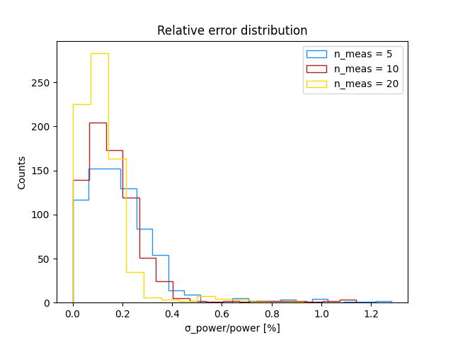
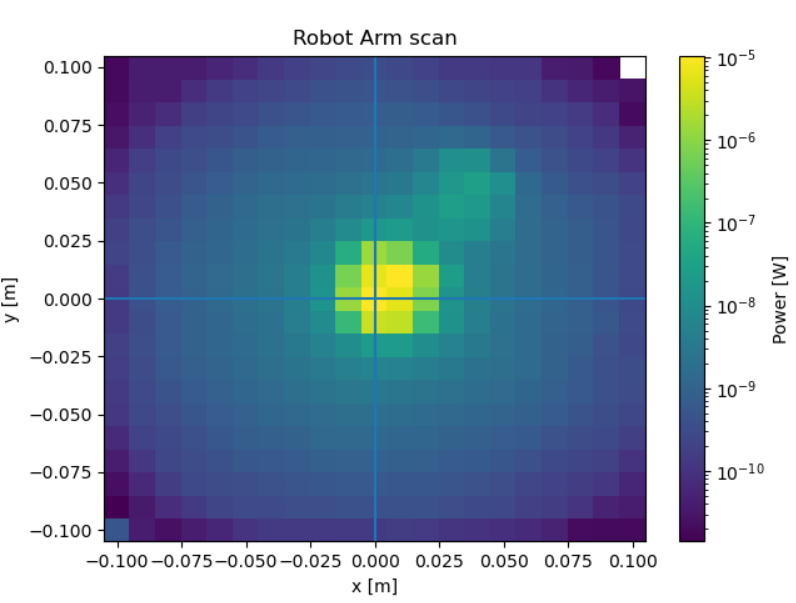
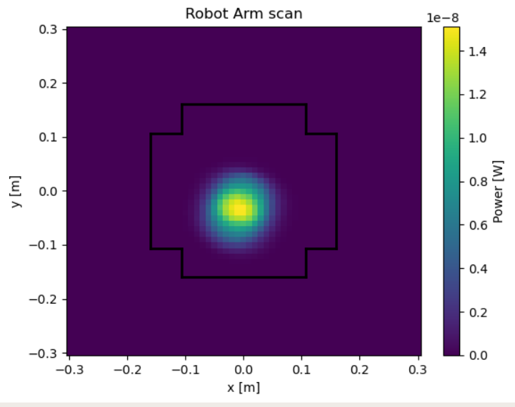
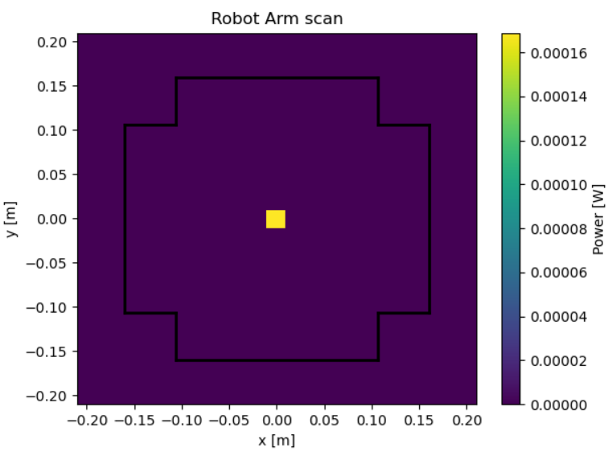

# ROBOT ARM 2D SCANS

The robot arm is implemeted as a DBM subsystem that allows to perform two-dimensional scans (with fixed z coordinate) on the laser beam.
The RA has a pre-defined 'home' position, which is 'in front' of the laser exit (word it better): it reaches such position at the beginning and at the end of each scan.
The scan can be performed by defining the scan size, i.e. the radius of the scan (measured in meters, where the home position is the center of the circle) and the scan step (m), i.e. the distance between two consecutive steps; the scan script allows the RA to reach only the positions that are confined in a maximum radius defined as 0.3 m.

Power measurements are performed by a powermeter mounted on the tip of the RA; at each step the PM takes 10 measurements (and if it fails, it tries for 10 times); the number of measurements at each step has been defined after observing the relative error distribution in three different cases, n_meas = 5, 10, 20. 

 

n_meas = 10 is a good compromise between having a not too broad error distribution and a not too long measuring time.

The goal is to scan the laser beam, check its uniformity (which by requirements should have a rel. std. < 2%) and describe it in terms of coordinates of the center.

Various iterations on different scan sizes and scan steps have highlighted possible criticities, such as reflections of light on shiny surfaces and weird patterns (denominated "ghosts") caused by light following strange paths in the beam splitter (or maybe better, exiting the beam splitter with weird angles) (following example)
 

 
Further investigations highlighted that the beam was not well centered w.r.t. the camera center (CHEC-S) 
 

 

The setup was then realigned; this allowed to define a procedure for realignment, which consists in iteratively checking the laser pointing while adjusting one set-up item at a time, starting from the laser fiber itself; in order
- laser fiber 
- filter wheel
- beam splitter
- beam expander
- diffuser(s)

All of this while trying to reduce as much as possible the dependence of each item on the other (they are all screwed on the same board, one small change on one item could imply a big change in the laser pointing if the set-up is screwed all together as one; it is better, therefore, to screw each item on the board indipendently from one another, i.e. not screwing two adjacent items together).

At this point the laser beam is quite well centered w.r.t. the RA PM (at a distance of 1 m); the only big remainder criticity is the sensitivity of the laser fiber cable, which can cause very big misalignments with a very small movement/variation of conditions: the following measurements have been performed keeping that in mind and with the idea that the final set-up will have to be very well stiff and stable (i.e. the fiber being very well screwed/glued alltogether)
 

 

It is possible to study the uniformity of the beam with the use of 20° + 5° diffusers and no aperture; putting an aperture at the exit of the diffusers would ensure that light would not hit the DarkBox walls, ceiling or flooring; the aperture, however, "bends" the laser beam (describe better...). Since the DarkBox is roughly 2.4 m high and we are interested in covering the whole CHEC-S camera - less then 0.3 m radius - at a 3 m distance, using two diffusers of 20° + 5° should ensure that the light would hit the flooring approximately at a distance of 4.47 m, so right now the light may just hit the black curtain of the DarkBox (which is not the ideal case, but still not the worst).

With this setup we study the uniformity of the laser beam and its centering (measures with and without diffusers).
